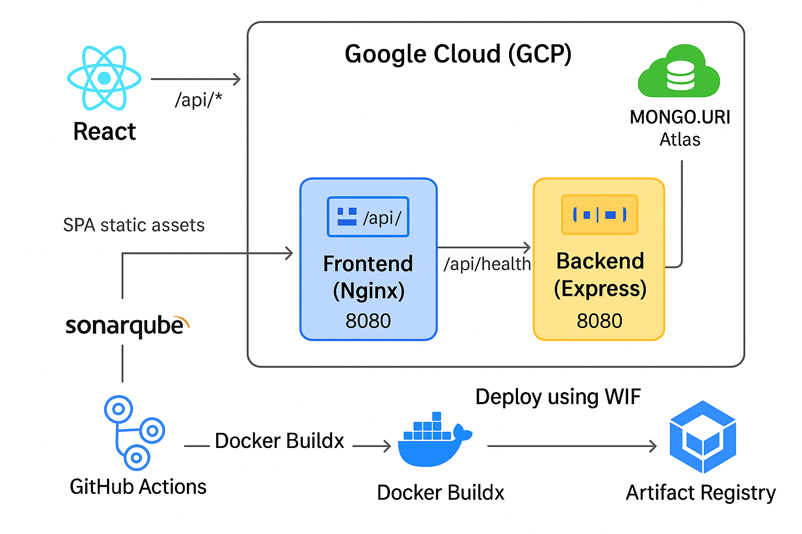

# 🚀 Cloud-Native DevOps Demo (React + Node + GCP Cloud Run + MongoDB Atlas)

A tiny full-stack app that demonstrates **cloud-native delivery on GCP**:
- **Frontend**: React SPA served by **Nginx**, proxying `/api/*` to the backend.
- **Backend**: Node/Express REST API with `/api/users` persisted in **MongoDB Atlas**.
- **CI/CD**: GitHub Actions → **Artifact Registry** → **Cloud Run** via **Workload Identity Federation** (no long-lived keys).
- **Security**: Container image scanning with **Trivy**.
- **Optionally**: **SonarQube** code analysis (if tokens are provided).

---
Live services

Frontend: https://frontend-z3e5qg5e7q-el.a.run.app/

Backend: https://backend-z3e5qg5e7q-el.a.run.app/

## 🏗️ Architecture

Here’s the high-level system design for this project:

🖥️ Deploy (CI/CD)

1. On push to main:
2. Authenticate to GCP via Workload Identity Federation
3. Build & push images → Artifact Registry
4. Trivy scans (non-blocking by default)
5. (Optional) SonarQube scan
6. Deploy backend, capture URL
7. Deploy frontend with BACKEND_URL=<backend-url>

📁 Repository layout
.
├── backend/
│   ├── Dockerfile
│   ├── package.json
│   └── server.js                # Express API (list/add users), health endpoints
├── frontend/
│   ├── Dockerfile               # Multi-stage build → Nginx runtime
│   ├── nginx.conf.template      # proxies /api/* → $BACKEND_URL
│   ├── package.json
│   ├── public/, src/
│   └── src/App.js, src/App.css  # polished UI + /api integration
├── .github/workflows/ci-cd-gcp.yml
└── README.md

🚢 CI/CD pipeline (what happens on main)

Auth to GCP using Workload Identity Federation (no JSON key).

Compute image names → asia-south1-docker.pkg.dev/<PROJECT>/<GAR_REPO>/{backend,frontend}.

Sanity build: npm ci and npm run build (frontend).

Build & push both images to Artifact Registry.

Trivy scan images (non-blocking).

Optional SonarQube analysis.

Deploy backend to Cloud Run with MONGO_URI.

Deploy frontend to Cloud Run with BACKEND_URL (backend’s URL).

Print service URLs.
